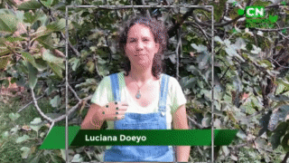

# LSA-T: The first continuous LSA dataset

LSA-T is the first continuous Argentinian Sign Language (LSA) dataset. It contains ~22 hs of video extracted from the [CN Sordos YouTube channel](https://www.youtube.com/c/CNSORDOSARGENTINA) with spanish subtitles, joints for each signer and the infered signer if there is more than one person in a clip. Videos are in 30 FPS full HD (1920x1080).

* [Download labels](https://app.seni.ar/datasets/labels.csv)
* [Download clips](https://app.seni.ar/datasets/clips.7z)
* [Download keypoints]()
* [Presentation paper](https://link.springer.com/chapter/10.1007/978-3-031-22419-5_25)

|                                               |                                               |                                               |
|-----------------------------------------------|-----------------------------------------------|-----------------------------------------------|
|  |  |  |

## Files and format

### [labels.csv](https://app.seni.ar/datasets/labels.csv)

This file contains labels and extra metadata for the 8459 clips. It contains the following columns:

* ``id``: id of the clip. It's used as the name of the mp4 file and the key for its keypoints.
* ``label``: the spanish translation of the clip.
* ``video``: title of the video which the clip belongs to.
* ``playlist``: title of the playlist which the clip belongs to.
* ``start``: time in seconds where the clip starts (respect to the video).
* ``end``: time in seconds where the clip ends (respect to the video).
* ``duration``: duration of the clip in seconds.
* ``splits``: clips are cropped according to sentences. Sentences might be split into many pieces of subtitles, so data of this splits is kept as a list of tuples containing (``piece_of_subtitle``, ``start``, ``end``). ``start`` and ``end`` are stored as time in seconds respect to the whole video.
* ``prev_delta``: as sometimes cropping clips according to the subtitles timestamp resulted in cropping signs, a time delta was added. By default is of 0.5 secs, unless there is another clip that ends nearer the video, in that case, the distance of the ending time of the previous clip and current clip's starting time it's used as delta.
* ``post_delta``: same as ``prev_delta`` but at the end of each clip.
* ``signers_amount``: amount of people (potential signers) present in the clip (detected by YOLOv8).
* ``infered_signer``: id of the person infered to be the signer (used to identify it's keypoints in the keypoints file).
* ``infered_signer_confidence``: confidence of the semi automatic signer inference (from 0 to 1).
* ``movement_per_signer``: amount of movement computed for each signer.

### [clips.7z](https://app.seni.ar/datasets/clips.7z)

Contains the clips in mp4, full HD 30 FPS. Their name matches their id in the ``labels.csv`` file.

### [joints.h5]()

Contains the joints for each person in each clip and their bounding boxes. The hdf5 dataset contains a group for each clip (accesed by the clip's id) and then a group for each signer (ids as signer_i).

## Statistics and comparison with other DBs (original paper version)

|                     | **LSA-T**          | **PHOENIX***     | **SIGNUM**      | **CSL**            | **GSL**     | **KETI**           |
|-------------------------|--------------------|------------------|-----------------|--------------------|-------------|--------------------|
| **language**            | Spanish            | German           | German          | Chinese            | Greek       | Korean             |
| **sign language**       | LSA                | GSL              | GSL             | CSL                | GSL         | KLS                |
| **real life**           | **Yes**            | **Yes**          | No              | No                 | No          | No                 |
| **signers**             | **103**            | 9                | 25              | 50                 | 7           | 14                 |
| **duration (h)**        | 21.78              | 10.71            | 55.3            | **100+**           | 9.51        | 28                 |
| **# samples**           | 14,880             | 7096             | **33,210**      | 25,000             | 10,295      | 14,672             |
| **# unique sentences**  | **14,254**         | 5672             | 780             | 100                | 331         | 105                |
| **% unique sentences**  | **95.79%**         | 79.93%           | 2.35%           | 0.4%               | 3.21%       | 0.71%              |
| **vocab. size (w)**     | **14,239**         | 2887             | N/A             | 178                | N/A         | 419                |
| **# singletons (w)**    | **7150**           | 1077             | 0               | 0                  | 0           | 0                  |
| **% singletons (w)**    | **50.21%**         | 37.3%            | 0%              | 0%                 | 0%          | 0%                 |
| **vocab. size (gl)**    | -                  | **1066**         | 450             | -                  | 310         | 524                |
| **# singletons (gl)**   | -                  | **337**          | 0               | -                  | 0           | 0                  |
| **# singletons (gl)**   | -                  | **31.61%**       | 0%              | -                  | 0%          | 0%                 |
| **resolution**          | **1920x1080**      | 210x260          | 776x578         | **1920x1080**      | 848x480     | **1920x1080**      |
| **fps**                 | **30**             | 25               | **30**          | **30**             | **30**      | **30**             |

## Usage 

**Deprecated, working in a new version of the loader**

This repository can be installed via ``pip`` and contains the [``LSA_Dataset``](https://github.com/midusi/LSA-T/blob/main/lsat/dataset/LSA_Dataset.py) class (in ``lsat.dataset.LSA_Dataset`` module). This class inherits from the [Pytorch dataset class](https://pytorch.org/tutorials/beginner/basics/data_tutorial.html) and implements all necessary methods for using it with a Pytorch dataloader. It also manages the downloading and extraction of the database.

Also, useful transforms for the clips and keypoints are provided in [``lsat.dataset.transforms``](https://github.com/midusi/LSA-T/blob/main/lsat/dataset/transforms.py)

## Citation

    Dal Bianco, P., Ríos, G., Ronchetti, F., Quiroga, F., Stanchi, O., Hasperué, W., & Rosete, A. (2022, November). Lsa-t: The first continuous argentinian sign language dataset for sign language translation. In Ibero-American Conference on Artificial Intelligence (pp. 293-304). Cham: Springer International Publishing.
